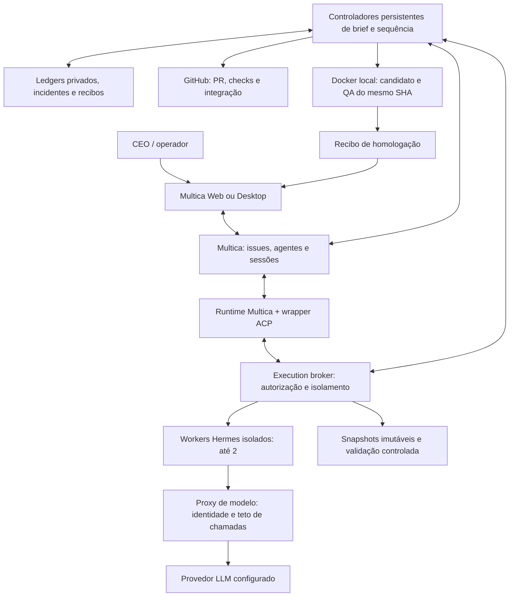
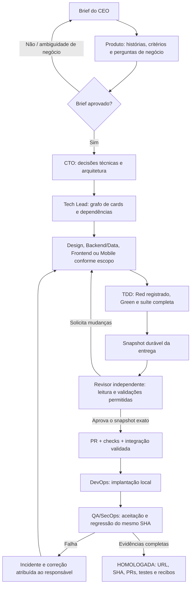
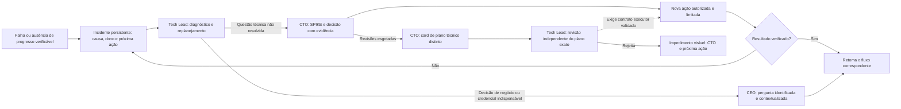

# Fabriquinha

Uma equipe de agentes de IA para transformar um brief de produto em software revisado, testado e entregue em homologação, usando GitHub e infraestrutura própria.

**Estado: experimental — autonomia completa ainda não qualificada.** Este repositório publica o código da plataforma em construção, não uma promessa de instalação pronta para produção. Ensaios descartáveis já percorreram implementação, revisão independente, PR, CI e QA no mesmo commit. Ainda faltam demonstrar um novo ciclo integral sem reparos do operador e simplificar a instalação para terceiros.

## O que queremos construir

O CEO descreve o resultado desejado. Produto refina o brief; CTO decide arquitetura; Tech Lead organiza o trabalho. Os agentes implementam com TDD, corrigem apontamentos de revisão e integram entregas pelo GitHub. A versão só é entregue quando o ambiente de homologação e suas evidências são verificáveis.

Não é um chat de bots que considera uma promessa como ação executada. Responsabilidade, dependências, snapshots, incidentes e recibos ficam em estado persistente. O término de uma resposta não encerra uma release.

## Arquitetura atual



Multica é o plano de colaboração; Hermes executa os agentes; os controladores e o broker implementam as restrições e a recuperação que não podem depender apenas de prompts. **Temporal foi estudado, mas não está integrado ao runtime atual.** Telegram pertence à instalação Hermes anterior, não é requisito deste caminho de avaliação.

O transporte ACP distingue prompts de cliente (até 12.000 caracteres) de contextos completos registrados, construídos e qualificados pelo broker (até 32.000). A qualificação é interna: JSON, marcadores de texto e declarações do agente não ampliam o limite nem concedem ferramentas. Isso preserva o contexto dos handoffs, mas não substitui a qualificação de recuperação e entrega ponta a ponta.

Uma falha comprovada do diagnóstico do CTO antes de `session/prompt`, causada pelo antigo limite de contexto, admite uma única recuperação após validar a condição corrigida. O controlador preserva a tentativa anterior, registra a intenção antes do wakeup e apenas observa um envio de resultado incerto; não repete o POST. Essa recuperação não reinicia o autor, não produz Red e não aprova a entrega. Nova falha permanece visível e bloqueada para diagnóstico técnico.

Falhas de suíte com Red herdado de um card dependente usam referências verificadas à evidência completa, sem copiar logs extensos para o wakeup limitado. O broker expande os dados apenas para o destinatário e a execução efetivamente registrados; snapshots de código e testes continuam montados somente para leitura. O diagnóstico não aprova testes nem autoriza homologação.

Uma rota pausada pode fornecer sua referência de Red exclusivamente para diagnóstico de uma execução encerrada e autenticada. A qualificação normal de entrega continua exigindo rota habilitada e seus gates independentes. Erros do worker saem do transporte somente como categorias fixas; categorias ausentes permanecem indeterminadas e não podem ser inferidas pela quantidade de chamadas nem usadas como autorização de retry.

Quando o CTO propõe corrigir testes de um Red herdado, a proposta mantém a origem, profundidade e critérios do contrato e segue para inspeção independente do Tech Lead. Essa inspeção não concede edição, cria uma terceira revisão recursiva ou aprova entrega. Um eventual ajuste exige experimento fundamentado e emenda do contrato independentemente revisada; o executor dessa emenda ainda é uma etapa de qualificação, não uma capacidade presumida.

O experimento de sintaxe de harness verifica os hashes do snapshot antes e depois,
extrai uma constante Python sem importar os testes e compila o JavaScript sem
executar o produto. Seu resultado é somente diagnóstico: sintaxe válida não
comprova funcionamento, Red legítimo ou homologação. O planejamento de uma emenda
preserva a linhagem e exige uma nova revisão independente; a nova execução ainda
precisa demonstrar compilação do harness, controles negativos comportamentais,
Red no baseline original e todos os gates posteriores.

A emenda do harness possui agora um gate de calibração antes da captura de Red:
compilação, referência correta e 12 defeitos controlados (respostas indevidas,
requisições duplicadas, estado pendente, timers e interferência). O job usa o
snapshot somente leitura, sem rede, credenciais ou socket Docker. Erros de runtime,
skips ou uma referência correta rejeitada não contam como controles negativos
válidos. O recibo persistente fica vinculado ao mesmo manifesto e é revalidado na
revisão. A rejeição do harness antigo inválido foi verificada; a aprovação de uma
nova entrega e o ciclo integral continuam pendentes. Este gate especializado do
ensaio não constitui calibração genérica para qualquer projeto.

O writer mantém o limite de 32.768 bytes e distingue rejeições de caminho e de
tamanho sem alterar o arquivo. Para testes novos herdados próximos desse teto,
o contexto de patch usa as leituras completas para orientar uma redução estreita
de comentários redundantes, preservando métodos, assertions e critérios. Uma
requalificação administrativa única exige arquivo preservado, identidade do
workspace, duas rejeições reais e política corrigida; apenas reabre o diagnóstico
independente do CTO. Não reinicia diretamente o autor, aumenta limites, reinicia
profundidade ou aprova Red e entrega.

Rejeições de calibração registram o CTO a partir da rota persistente, não do
objeto de qualificação do harness. A reconciliação de um job rejeitado observa
somente o contêiner e a imagem originais, mesmo após atualizar o controlador;
não recria jobs, reexecuta o autor ou transforma rejeição em aprovação.

O provedor usado na instalação de referência é OpenRouter com DeepSeek. Modelos e custos não são gratuitos por definição: o teto de chamadas é uma proteção, não um orçamento monetário. Não há fallback pago automático.

## Fluxo da equipe



Este é o contrato da equipe; nem todos os nove papéis estão exercitados em cada ensaio. Consulte [o catálogo de papéis](team-delivery-kit/team.example.json). Mobile fica desabilitado quando o produto é somente web. Papéis futuros de observabilidade e análise de produto estão reservados, ainda desabilitados.



Voltar a existir um worker não resolve um incidente. Falta de evidência não vira sucesso. A plataforma bloqueia ações repetidas quando a recuperação exige nova decisão; não promete eliminar todo impedimento automaticamente.

O novo caminho de replanejamento preserva as tentativas anteriores e os critérios
aprovados; não zera contadores nem abre uma terceira revisão recursiva. A etapa
de plano/revisão é não executora: sua aprovação ainda precisa ser consumida por
um adaptador de execução validado. Veja o [contrato de replanejamento](team-delivery-kit/docs/technical-remediation-plan.md).

## Qualidade e segurança

- Red-Green-Refactor com recibos históricos; o revisor não reexecuta Red destruindo a implementação.
- Revisão independente ligada ao autor, execução e snapshot exato; alterações invalidam aprovações anteriores.
- Proteção contra exclusão, `skip` e enfraquecimento de testes; análise semântica também exige revisão independente.
- PR, CI, implantação e QA ligados ao commit correto. Um teste verde não equivale a uma release homologada.
- Credenciais e estado de execução ficam fora do Git; workers não recebem o socket Docker nem credenciais de infraestrutura.
- O controlador com socket Docker tem poder amplo sobre o host. Use máquina de avaliação dedicada e não exponha serviços locais na Internet.
- Containers devem aparecer nos grupos Compose `delivery-kit-<instância>`, `delivery-kit-<instância>-tests` e `delivery-kit-<instância>-homologation`.

Leia [SECURITY.md](SECURITY.md) antes de executar qualquer instalação.

## Organização do código

```text
fabriquinha/
├── README.md                   # Visão atual e diagramas
├── docs/                       # Arquitetura, instalação, limites e roadmap
├── scripts/                    # Verificação da publicação e desenvolvimento
├── .github/workflows/          # Checks offline; sem chave LLM ou Docker do host
├── team-delivery-kit/          # Implementação ativa (layout preservado)
│   ├── broker/                 # Execução, handoffs, isolamento e recuperação
│   ├── deploy/                 # Construção e homologação controladas
│   ├── contracts/              # Contratos compartilhados
│   ├── projects/               # Exemplos e fixtures de ensaios, não configuração universal
│   ├── tests/                  # Testes determinísticos e controles negativos
│   ├── evaluation/             # Proveniência e fixture público do guard
│   ├── compose*.yaml           # Serviços e overrides dos ensaios
│   └── *.py / Dockerfile*      # Entrypoints e módulos existentes
└── bootstrap/infra/            # Código histórico Hermes; não iniciar junto ao kit
```

Os arquivos da implementação ativa não foram movidos: builds e testes dependem dos caminhos atuais. [O mapa de módulos](docs/ARCHITECTURE.md) fornece as entradas corretas. Dockerfiles numerados e scripts de recuperação histórica ficam preservados para rastreabilidade; não são o ponto de partida de uma instalação nova.

## Começar sem gastar tokens

Pré-requisitos para testes offline: Git, Python 3.14 e `venv`. A referência operacional utiliza macOS com Docker Desktop e containers Linux ARM64. Outras plataformas não foram qualificadas ponta a ponta.

```bash
git clone https://github.com/codifydeep/fabriquinha.git
cd fabriquinha
python3.14 -m venv .venv
. .venv/bin/activate
python -m pip install -r team-delivery-kit/requirements-test.txt
python scripts/check_publication.py
cd team-delivery-kit
PYTHONPATH=. python -m unittest discover -s tests -q
```

Esses testes não precisam de chaves, não disparam agentes e não demonstram autonomia completa. Para subir **somente o plano de controle**, veja [SETUP.md](docs/SETUP.md). Não execute scripts de ensaios ou overrides específicos da instalação de referência como se fossem um instalador genérico.

## Situação das validações

Referência em 6 de outubro de 2026:

- `BRIEFSTATUS-1` percorreu dois cards dependentes, PRs, CI e QA HTTP/browser em dois contextos; reparos anteriores do operador impedem classificá-lo como prova integral sem intervenção.
- `BRIEFDEMO-2` é um novo ciclo; a clarificação de negócio foi respondida pelo CEO e a retomada está em validação. Não foi entregue.
- O Truco continua fora dos ensaios de qualificação. Não confundir a aplicação descartável com o produto final.
- Instalação limpa, configuração portátil, recuperação totalmente autônoma e entrega de um produto completo ainda são lacunas.

Resumo público e limites: [VALIDATION.md](docs/VALIDATION.md). O diário completo do operador permanece privado. Estado vivo, conversas e recibos privados não são publicados. Veja [ROADMAP.md](docs/ROADMAP.md).

## Contribuir e reutilizar

O código próprio está sob a [licença MIT](LICENSE), permitindo reutilização e uso comercial com preservação do aviso. Leia [CONTRIBUTING.md](CONTRIBUTING.md) e [os avisos de terceiros](THIRD_PARTY_NOTICES.md). Dependências e patches sobre projetos externos mantêm suas próprias licenças.
