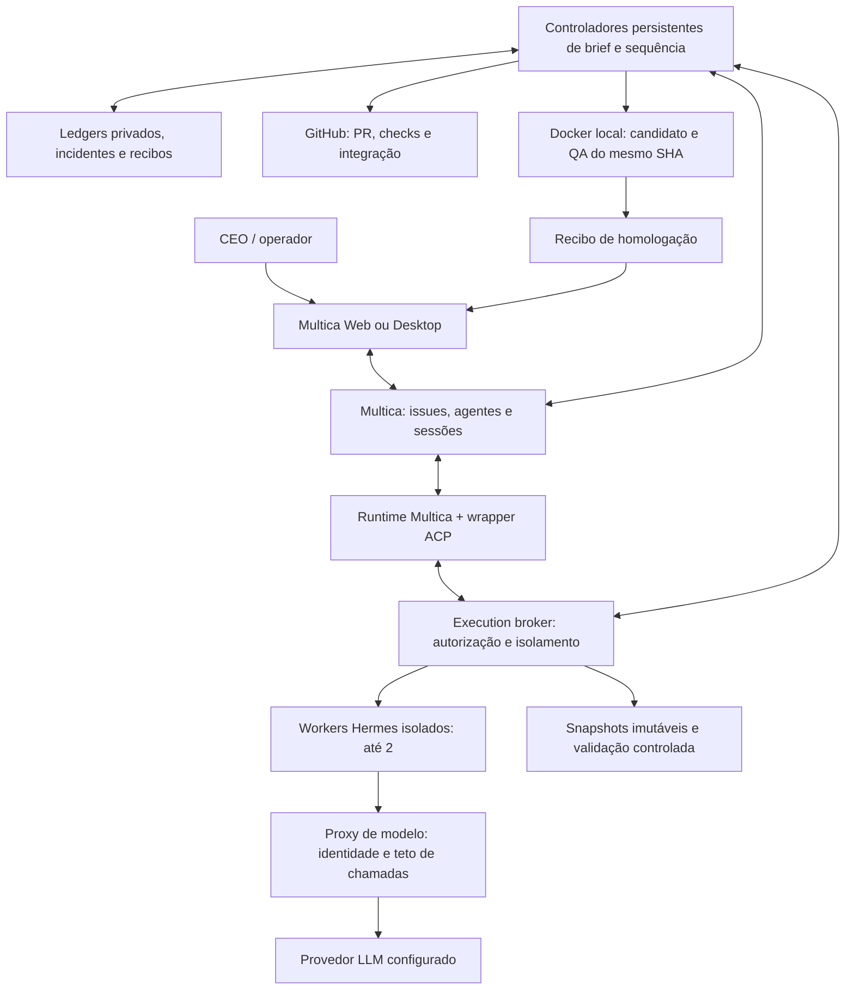
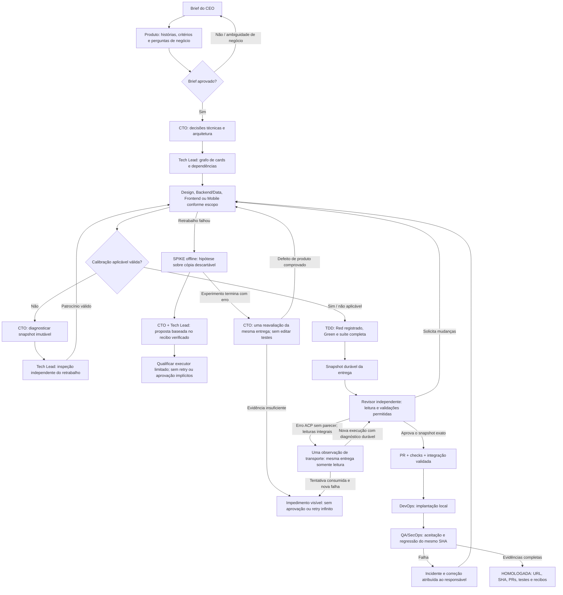
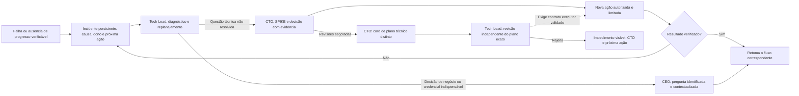

# Fabriquinha

Uma equipe de agentes de IA para transformar um brief de produto em software revisado, testado e entregue em homologação, usando GitHub e infraestrutura própria.

**Estado: experimental — autonomia completa ainda não qualificada.** Este repositório publica o código da plataforma em construção, não uma promessa de instalação pronta para produção. Ensaios descartáveis já percorreram implementação, revisão independente, PR, CI e QA no mesmo commit. Ainda faltam demonstrar um novo ciclo integral sem reparos do operador e simplificar a instalação para terceiros.

Correções de planos rejeitados usam referências a registros completos do controlador,
vinculadas ao card, CTO, wakeup ativo e hash da revisão. O gateway expande esses
registros sem truncamento e guarda um recibo de apresentação; referências antigas
ou de outro agente são rejeitadas. Os limites de handoff e transporte permanecem
inalterados. Essa melhoria de contexto não concede aprovação nem qualifica, por
si só, a entrega autônoma.
O fluxo de diagnóstico de timers também verifica equivalência integral entre
cópias da base original antes de provisionar a correção. Falhas semânticas dessa
continuação são persistidas com responsável técnico e próxima ação, sem repetir
indefinidamente a mesma operação ou converter o plano aprovado em entrega aprovada.
Rejeições de patches pelo limite de tamanho do arquivo recebem diagnóstico
estruturado a partir dos resultados reais das ferramentas. Uma execução falha,
encerrada e com snapshot preservado pode gerar um novo diagnóstico independente
do CTO quando a primeira escalada recebeu evidências vazias. O registro é único
por card, não aumenta limites e não autoriza automaticamente repetir o autor.

O encaminhamento de falhas anteriores ao início do worker possui uma extensão
instalada, ainda em validação ponta a ponta: exige capability consumida, execução nativa falha, erro persistido
de criação e o contêiner original identificado, nunca iniciado, sem eventos ACP
ou ferramentas executadas. Antes do planejamento técnico, congela a nova entrega
e compara todos os bytes com a anterior. CTO e Tech Lead recebem decisões novas,
sem reaproveitar aprovações ou repetir o autor. A qualificação instalada do worker
e do proxy continua obrigatória. A instalação preserva o worker e o proxy
qualificados; o handoff nativo completo ainda precisa ser comprovado. Os testes
offline não liberam o Truco.

Uma recuperação administrativa específica do CTO exige falha anterior ao ACP,
zero ferramentas, capability de planejamento consumida e a política completa do
worker conferida. Somente a omissão de `NetworkDisabled=false` na inspeção Docker
é normalizada; modo de rede, mounts, imagem e demais controles continuam exatos.
A intenção de retirada do worker terminal precede o novo planejamento, e um
resultado incerto de remoção é observado sem repetir o DELETE. Decisão anterior,
startup e identidade da execução ficam preservados; a nova identidade de handoff
não aprova entrega, reinicia o autor nem amplia limites. Esta recuperação ainda
exige validação instalada e não qualifica a autonomia ponta a ponta.

Inspeções de workers registrados agora têm recibos persistentes, deduplicados,
gravados antes do transporte ACP e antes da retirada Docker. Os recibos guardam
identidade, hash da política e categorias de divergência, sem configuração Docker
completa, variáveis ou credenciais. Uma política divergente continua impedindo a
continuação; registrar a observação não concede retry ou aprovação. Execuções
antigas sem recibo não são convertidas retroativamente em evidência válida. O
probe integrado pode exercitar o booleano de rede padrão e conferir a sobrevivência
dos recibos após a retirada, sem sessões, prompts ou chamadas de modelo.
O [probe instalado de 7 de outubro](team-delivery-kit/evaluation/STARTUP-POLICY-OBSERVATIONS-2026-10-07.json)
comprovou esse comportamento com Docker, wrapper, ACP e inicialização Hermes reais:
uma criação, um start e um transporte, sem chamadas ao modelo. A identidade nativa
desse teste é uma fixture descartável, não um handoff real do Multica. O incidente
legado do CTO continua sem a inspeção original; esse probe não a reconstitui nem
aprova uma entrega.

Para um incidente legado cujo worker já foi retirado sem inspeção arquivada, uma
manutenção pode abrir **um novo diagnóstico somente leitura**, não confirmar a
causa antiga. Ela exige execução nativa do CTO falha, capability de planejamento
consumida, zero ACP e ferramentas, retirada comprovada, entrega imutável conferida
e o arquivo privado do probe instalado validado contra os hashes atuais. O novo
contexto declara a inspeção ausente e a causa não comprovada. Há identidade nova,
intenção persistida antes do despacho e nenhuma aprovação herdada. CTO e Tech Lead
ainda precisam ler a entrega e tomar decisões independentes; autor, Red, revisão,
PR/CI e homologação continuam protegidos pelos gates originais. Essa admissão de
diagnóstico não é uma recuperação genérica nem uma entrega autônoma qualificada.

## O que queremos construir

O diagnóstico agora distingue execução do agente concluída de falha posterior
na suíte congelada. Esse caminho exige snapshot completo, escopo fechado,
testes preservados e reprodução controlada da falha antes da proposta do CTO e
inspeção independente do Tech Lead. Ele não concede edição de testes ou aprovação
da entrega. A validação ponta a ponta desse caminho continua em andamento.
Uma continuação específica agora executa um experimento fixo de contagem de
requisições e encaminha a evidência ao planejamento do CTO e à revisão do Tech
Lead. Intenções Docker persistem antes das ações, e uma resposta incerta é
observada sem repetição. Isso autoriza planejamento, não implementação ou
homologação; o novo plano e os gates posteriores ainda precisam ser validados.
O primeiro plano dessa continuação já recebeu aprovação independente. A passagem
à execução exige equivalência física completa das cópias da base e, para os
novos testes, calibração com tráfego paralelo. Recebimentos antigos não são
convertidos retroativamente em evidência desses controles novos.

O CEO descreve o resultado desejado. Produto refina o brief; CTO decide arquitetura; Tech Lead organiza o trabalho. Os agentes implementam com TDD, corrigem apontamentos de revisão e integram entregas pelo GitHub. A versão só é entregue quando o ambiente de homologação e suas evidências são verificáveis.

Não é um chat de bots que considera uma promessa como ação executada. Responsabilidade, dependências, snapshots, incidentes e recibos ficam em estado persistente. O término de uma resposta não encerra uma release.

## Arquitetura atual



Multica é o plano de colaboração; Hermes executa os agentes; os controladores e o broker implementam as restrições e a recuperação que não podem depender apenas de prompts. **Temporal foi estudado, mas não está integrado ao runtime atual.** Telegram pertence à instalação Hermes anterior, não é requisito deste caminho de avaliação.

O diagnóstico de incidentes de publicação aceita o envelope nativo exato de
wakeup do Multica, sem tratá-lo como outro contrato ou autorização. Quando Tech
Lead e CTO falharam por essa incompatibilidade local, recibos ACP e rejeições
persistentes do proxy permitem qualificar o transporte corrigido com os dois
envelopes reais, sem chamada ao modelo. A nova evidência abre outro ciclo de
diagnóstico e revisão independente; não reabre tarefas falhas, aprova entrega
ou reinicia a publicação por si só. Falhas contra essa nova evidência continuam
visíveis, sem repetição automática idêntica. A qualificação do transporte não
substitui a recuperação ponta a ponta.

Diagnósticos e revisões de incidentes de publicação possuem uma única correção
de formato para `reason` entre 601 e 4.000 caracteres quando esse é o único erro
do schema. O modelo deve produzir novos argumentos válidos; o proxy não trunca
texto, não altera a decisão e rejeita mudanças em qualquer outro campo. O ledger
registra o consumo antes da nova chamada e impede outra correção na mesma
execução, inclusive após reinício. Duas falhas técnicas antigas desse formato
só admitem novo diagnóstico após qualificação model-free da receita instalada;
essas falhas e seus recibos permanecem preservados, sem aprovação de entrega.

Uma submissão de incidente com JSON malformado admite uma única nova chamada
de formato, registrada antes do envio. Isso vale apenas para a ferramenta
esperada e uma resposta terminal sem conteúdo paralelo; argumentos inválidos
não são executados, reaproveitados ou tratados como decisão. Uma revisão antiga
que falhou por esse motivo só pode receber novo wakeup após prova durável da
falha e qualificação sem modelo da receita instalada. O novo revisor continua
vinculado à proposta original e aos mesmos gates; a falha anterior é preservada.
Esse mecanismo não aprova a entrega nem comprova autonomia ponta a ponta.

Uma retenção de publicação diagnosticada e revisada pode receber uma única
reavaliação quando o catálogo fixo de capacidades foi qualificado e ainda não
constava da evidência original. Esse catálogo explica que ausência do processo
não impede observar sua ausência ou verificar snapshot, CI e implantação por
seus próprios identificadores duráveis. Ele descreve operações, não comprova
resultados nem concede ferramentas. A nova ocorrência continua sujeita a
diagnóstico, revisão independente e verificação pelo controlador; a decisão
antiga é preservada. Outra retenção com o mesmo catálogo não dispara repetição.

O transporte ACP distingue prompts de cliente (até 12.000 caracteres) de contextos completos registrados, construídos e qualificados pelo broker (até 32.000). A qualificação é interna: JSON, marcadores de texto e declarações do agente não ampliam o limite nem concedem ferramentas. Isso preserva o contexto dos handoffs, mas não substitui a qualificação de recuperação e entrega ponta a ponta.

Uma falha comprovada do diagnóstico do CTO antes de `session/prompt`, causada pelo antigo limite de contexto, admite uma única recuperação após validar a condição corrigida. O controlador preserva a tentativa anterior, registra a intenção antes do wakeup e apenas observa um envio de resultado incerto; não repete o POST. Essa recuperação não reinicia o autor, não produz Red e não aprova a entrega. Nova falha permanece visível e bloqueada para diagnóstico técnico.

Falhas de suíte com Red herdado de um card dependente usam referências verificadas à evidência completa, sem copiar logs extensos para o wakeup limitado. O broker expande os dados apenas para o destinatário e a execução efetivamente registrados; snapshots de código e testes continuam montados somente para leitura. O diagnóstico não aprova testes nem autoriza homologação.

Uma rota pausada pode fornecer sua referência de Red exclusivamente para diagnóstico de uma execução encerrada e autenticada. A qualificação normal de entrega continua exigindo rota habilitada e seus gates independentes. Erros do worker saem do transporte somente como categorias fixas; categorias ausentes permanecem indeterminadas e não podem ser inferidas pela quantidade de chamadas nem usadas como autorização de retry.

Os probes de patch distinguem uma proposta válida do provedor de uma edição
realmente executada pelo worker ACP. O ensaio real verifica o conteúdo exato,
sintaxe, preservação do baseline e pareamento dos eventos de ferramenta;
evidências de arquivo e transporte ficam exclusivamente no armazenamento privado.
Uma resposta com múltiplas chamadas onde o contrato exige uma só permanece
rejeitada. A aprovação isolada do proxy não qualifica o worker, a recuperação
automática ou a entrega ponta a ponta.

O proxy oferece uma única correção persistente de formato por execução para
respostas completas com múltiplas chamadas do mesmo tool forçado: leitura de
artefato com caminho/página fixados ou patch estreito do novo teste. Nenhuma das
chamadas rejeitadas é encaminhada; o modelo precisa propor uma nova chamada única,
validada pelo contrato original. Leituras e patches compartilham o mesmo limite;
reinícios, uma segunda falha ou resposta incompleta não rearmam a correção.

Rejeições de argumentos forçados de leitura/patch podem registrar o campo e a
restrição violada (enum, tipo, tamanho, bytes UTF-8 ou patch sem alteração), sem
armazenar caminhos ou conteúdo propostos. O recibo é vinculado à execução e à
chamada, não comprova execução de ferramenta e não autoriza retentativa. Eventos
antigos sem essa informação permanecem com causa específica desconhecida; não
se pode inferir o argumento errado apenas pela categoria genérica da rejeição.

O controlador pode encaminhar uma rejeição de argumento comprovada para novo
diagnóstico independente do CTO, desde que a execução encerrada tenha snapshot
preservado, não exista Red nem worker ativo e autor/revisor permaneçam distintos.
O fingerprint usa ferramenta, categoria e restrição; mudar IDs ou contagens de
tamanho não rearma a mesma falha. Há no máximo dois diagnósticos distintos desse
tipo por card, persistidos antes do despacho. Sem a restrição violada comprovada,
uma decisão de repetir o trabalho do autor é bloqueada: o CTO deve especificar
qual evidência ou experimento diagnóstico falta. Isso não constitui recuperação
ponta a ponta, aprovação de entrega ou autorização para enfraquecer testes.

O experimento `probe_frozen_patch_provider.py` pode solicitar uma proposta ao
modelo usando código de um snapshot verificado e montado somente para leitura.
Os frames de leitura são explicitamente sintéticos: não contam como leituras
nativas ou execução do autor. Nenhum patch retornado é executado. Intenção e
identidade do experimento são persistidas antes da chamada; resultado incerto
não rearma a solicitação. O recibo distingue proposta válida, rejeição do proxy
e falha do contrato da fixture. Mesmo um resultado positivo não prova a causa
histórica, calibração, Red, revisão, implantação ou recuperação autônoma.
Rejeições locais novas registram a restrição allowlisted (fragmento, sintaxe,
tamanho, assertions ou descoberta), tamanho e hash da resposta, sem gravar seu
conteúdo no recibo público. Erros desconhecidos permanecem não classificados;
recibos anteriores não recebem causas inferidas retroativamente.
Uma sucessora de instrumentação exige um recibo terminal falho sem classificação,
os mesmos inputs e imagem do proxy, código diagnóstico diferente e uma intenção
única vinculada ao experimento anterior. Um resultado já classificado não permite
essa sucessora; ela não rearma o worker nem concede aprovação de produto.
Um experimento congelado com rejeição de tamanho pode alimentar uma única decisão
independente do CTO por card, mediante arquivo privado administrado pelo
controlador, identidade/hash conferidos, snapshot completo e ausência de workers
ou Red. O handoff mantém a causa histórica desconhecida e não muda limites.
Somente uma decisão técnica independente pode propor uma recuperação tests-only;
calibração, Red, revisão e homologação permanecem obrigatórios.
Restrições de argumentos medidas são apresentadas ao CTO com campo, valor
allowlisted e significado explícito. Um diagnóstico com `no_change` não recebe
o roteiro de causa desconhecida. Após escalonamento terminal, há no máximo uma
reanálise por card com essa apresentação corrigida, preservando a decisão
anterior e sem conceder autorização ao autor. Repetir IDs não rearma esse caminho.
O wrapper de calibração com tráfego de fundo preserva rejeições estruturadas
(fase e fatos) em vez de reduzi-las à classe da exceção. Para recibos antigos que
perderam esses dados, `run_calibration_diagnostic.py` permite uma única observação
offline do snapshot congelado com imagem diagnóstica identificada: sem rede,
credenciais, escrita no snapshot ou repetição da tarefa nativa. O resultado novo
é separado do original e não concede Red, retry do autor ou aprovação de entrega.
Essa correção está ativada na imagem de calibração do fluxo normal. Execuções
antigas continuam vinculadas à sua imagem original; seus recibos não são atualizados.
Observações separadas são verificadas pelo controlador contra o contêiner terminal,
imagem, isolamento, snapshot e hash reais. A recuperação existente exige leitura
completa pelo CTO e revisão independente do Tech Lead antes de patrocinar o autor.
O contexto dos planejadores destaca os controles negativos não detectados, mesmo
quando todos os testes da referência positiva passam. Isso não aprova Red ou entrega.
Para essa proposta estreita, o validador também preserva a forma estática de
descoberta, decorators, assinaturas, escopo das assertions e transferências de
controle; rejeita `skip`, renomeação ou sobrescrita de métodos, remoção de
`TestCase` e novas saídas antecipadas. Essas barreiras não demonstram ausência
de enfraquecimento semântico: calibração e revisão independente continuam
necessárias. Nenhum resultado desse experimento concede permissão de escrita.

A cópia test-first e a execução de Red usam jobs duráveis do controlador:
intenções de criação e início são registradas antes das chamadas Docker. Um
timeout mantém a observação do mesmo contêiner, sem repetir criação ou início;
o resultado e seu hash são guardados antes da retirada do job parado. A identidade
inclui imagem, comando, ambiente e isolamento. O limite de observação gera um
impedimento visível, não aprovação nem retry do autor. A migração de um timeout
legado exige manutenção selada, ausência de workers e snapshot íntegro, preservando
o recibo anterior. A suíte offline e uma sonda isolada no Docker real foram
validadas; isso não comprova Red legítimo do artefato, revisão independente ou
entrega autônoma. Outros caminhos Docker não recebem implicitamente essa garantia.

A identidade da imagem confere o ID canônico resolvido pelo Docker para a
referência imutável solicitada: `repositório@sha256:...` não é comparado
textualmente ao ID do contêiner. Todos os demais campos continuam obrigatórios.
Uma rejeição histórica causada apenas por essa comparação pode ser recuperada
em manutenção selada somente com calibração aprovada, autor terminal, snapshot
íntegro e o mesmo job Red comprovadamente nunca iniciado. A recuperação preserva
o recibo anterior e observa o job existente; não recria contêiner, reinicia autor,
dispensa testes ou renova seu orçamento de iterações.

O writer isolado analisa a sintaxe dos bytes propostos para arquivos Python antes
de abrir ou truncar o arquivo existente. Uma rejeição preserva o último conteúdo
válido e retorna uma mensagem fixa sem expor a linha submetida. Essa análise não
importa nem executa código e não comprova comportamento, cobertura ou TDD; Red,
Green, suíte completa e revisão independente continuam obrigatórios.

O probe nativo de patch usa argumentos fixos com `LocalEnvironment` e
`ShellFileOperations` reais, como usuário sem privilégios, em contêiner sem rede,
credenciais ou socket Docker. Ele verifica rejeição de sintaxe sem perda dos bytes
anteriores e preservação exata das aspas em um patch válido. Não chama modelo,
não qualifica a serialização ACP nem aprova autoria, TDD ou entrega; o ensaio com
modelo continua sendo uma validação separada.

Há também um ensaio ACP integrado com respostas fixas servidas apenas no loopback
de um contêiner sem rede. Ele percorre o SDK e o Hermes instalados, duas leituras,
rejeição de um patch com sintaxe inválida e um patch corretivo, verificando os
eventos ACP e o conteúdo final exato. Essa fixture não chama o provedor, não
comprova autoria pelo modelo e não substitui uma entrega autônoma com TDD,
revisão independente, PR, CI e QA do mesmo commit.

Qualificações offline podem reabrir uma análise técnica bloqueada somente quando
o controlador as vincula ao worker/writer atualmente instalados e ao mesmo
snapshot integralmente preservado. O certificado registra que a causa histórica
continua desconhecida e não concede retry ao autor. O CTO decide independentemente
se há um experimento corretivo concreto sustentado pelas condições novas; outro
impasse não rearma o mesmo certificado. A decisão anterior permanece registrada,
e calibração, Red e revisão continuam necessários antes de implementar o produto.

Quando o CTO propõe corrigir testes de um Red herdado, a proposta mantém a origem, profundidade e critérios do contrato e segue para inspeção independente do Tech Lead. Essa inspeção não concede edição, cria uma terceira revisão recursiva ou aprova entrega. Um eventual ajuste exige experimento fundamentado e emenda do contrato independentemente revisada; o executor dessa emenda ainda é uma etapa de qualificação, não uma capacidade presumida.

O experimento de sintaxe de harness verifica os hashes do snapshot antes e depois,
extrai uma constante Python sem importar os testes e compila o JavaScript sem
executar o produto. Seu resultado é somente diagnóstico: sintaxe válida não
comprova funcionamento, Red legítimo ou homologação. O planejamento de uma emenda
preserva a linhagem e exige uma nova revisão independente; a nova execução ainda
precisa demonstrar compilação do harness, controles negativos comportamentais,
Red no baseline original e todos os gates posteriores.

A emenda do harness possui agora um gate de calibração antes da captura de Red.
O diagnóstico da fase com polling legítimo inclui os 16 controles esperados,
inclusive timers que apenas alteram o indicador e timers com a mesma duração do
polling. Controles ausentes são apresentados como inválidos; passar a referência
positiva não oculta defeitos não detectados. Esse resumo não autoriza uma nova
execução nem substitui a revisão do snapshot.

Se a correção patrocinada terminar em falha e produzir uma nova calibração
rejeitada, o controlador pode abrir um diagnóstico separado para CTO e Tech Lead.
Isso exige a última execução do autor, checkpoint rejeitado, novo manifest e hash
de teste, contrato e responsáveis inalterados, job e saída conferidos, nenhum
worker ativo e nenhum Red aprovado. O incidente anterior é arquivado antes da
troca; ambos os pareceres produzem somente um plano de experimento em cópia
descartável, sem nova execução do autor, reset de limites ou aprovação de entrega.

O experimento fixo de atribuição de timers por escritas no indicador roda sobre
uma cópia descartável, sem rede, credenciais ou socket. Ele altera somente a
constante literal do harness, verifica a identidade da AST restante e os hashes
do snapshot antes e depois, e calibra os 16 controles com polling legítimo.
Também registra separadamente a observação do produto original: referência
positiva verde não implica produto verde. O ensaio real sustentou essa hipótese,
mas não constitui submissão do autor, Red/Green válido ou aprovação de entrega.
Resumos de planejamento podem compactar listas históricas de nomes de métodos;
contagens, controles inválidos e evidência integral permanecem disponíveis. Uma
recuperação por excesso de contexto retoma apenas a revisão pendente, uma vez,
sem repetir o parecer técnico ou patrocinar implementação.

Para a hipótese fixa de escritas no indicador, o controlador pode executar um
job durável após as duas propostas independentes. Confere a nova calibração,
controles comportamentais, limite de arquivo e observação separada do baseline;
somente então registra a intenção de uma correção tests-only pelo autor original.
Intenções ambíguas são observadas, nunca reenviadas. A cópia diagnóstica não é
montada como entrega do autor. A submissão real ainda exige nova calibração,
Red da suíte completa, revisão independente e todos os gates de PR, CI e QA.

O gate verifica compilação, referência correta e 12 defeitos controlados (respostas indevidas,
requisições duplicadas, estado pendente, timers e interferência). O job usa o
snapshot somente leitura, sem rede, credenciais ou socket Docker. Erros de runtime,
skips ou uma referência correta rejeitada não contam como controles negativos
válidos. O recibo persistente fica vinculado ao mesmo manifesto e é revalidado na
revisão. A rejeição do harness antigo inválido foi verificada; a aprovação de uma
nova entrega e o ciclo integral continuam pendentes. Este gate especializado do
ensaio não constitui calibração genérica para qualquer projeto.

O writer mantém o limite de 32.768 bytes e distingue rejeições de caminho e de
tamanho sem alterar o arquivo. Para testes novos herdados próximos desse teto,
o contexto de patch usa as leituras completas para orientar uma redução estreita
de comentários redundantes, preservando métodos, assertions e critérios. Uma
requalificação administrativa única exige arquivo preservado, identidade do
workspace, duas rejeições reais e política corrigida; apenas reabre o diagnóstico
independente do CTO. Não reinicia diretamente o autor, aumenta limites, reinicia
profundidade ou aprova Red e entrega.

Rejeições de calibração registram o CTO a partir da rota persistente, não do
objeto de qualificação do harness. A reconciliação de um job rejeitado observa
somente o contêiner e a imagem originais, mesmo após atualizar o controlador;
não recria jobs, reexecuta o autor ou transforma rejeição em aprovação.

O diagnóstico de calibração distingue compilação, referência positiva e controles
comportamentais. Rejeições retêm contagens, nomes dos métodos que falharam e hashes,
sem tracebacks ou código submetido. Esses fatos são vinculados ao manifesto do job
e não concedem retry, edição, Red, revisão aprovada ou homologação. O supervisor
possui uma trilha de retrabalho para a rejeição autenticada da calibração: CTO e
Tech Lead inspecionam integralmente o mesmo snapshot somente leitura e patrocinam
independentemente uma correção pelo autor original. Há uma entrada por card, sem
reset de profundidade ou limites, e todas as validações continuam obrigatórias.
Envios incertos são somente observados, nunca repetidos. Na instalação de
referência, CTO e Tech Lead concluíram decisões independentes e o controlador
acionou o autor original. A entrega mais recente passou pela calibração completa
(15 casos positivos e 16 controles negativos), produziu Red na suíte completa
de 323 testes sobre o produto-base e recebeu revisão independente do Tech Lead.
Isso qualifica R1, não o ciclo integral. Uma execução patrocinada que falha transfere
o impedimento ao CTO, preservando as decisões e sem novo despacho automático.

Na fase R1, o autor corrige e inspeciona somente o harness. O controlador executa
a calibração e a suíte completa sobre a entrega imutável. Falta da funcionalidade
no produto-base é Red esperado, não motivo para implementar o produto dentro do
harness ou perseguir Green. Orientação no proxy não substitui controles de acesso
nem comprova correção; o snapshot, as validações e a revisão independente continuam
sendo as evidências obrigatórias.

Quando uma entrega R1 preservada recebe esse gate verificado, o controlador
resolve somente o impedimento `author_execution_failed` correspondente. A sessão
original continua registrada como falha; o impedimento e sua resolução permanecem
no histórico. Não há reinício do autor nem autorização automática de R2: preparação,
admissão, capacidade e revisão do produto continuam obrigatórias. Outros impedimentos
não são apagados. A resolução exige conferir novamente as evidências reais do gate,
inclusive a leitura completa dos dois snapshots pelo revisor.

As validações de estrutura, suíte Green e preservação dos testes congelados usam
jobs persistentes, com intenção de criação/início gravada antes da operação Docker.
Um timeout exige observar o mesmo handle, não repetir o efeito nem reiniciar o
autor. O resultado e o hash do log ficam salvos antes da limpeza assíncrona; um
timeout de exclusão não substitui o veredito da suíte. A suíte de revisão tem
identidade própria por execução do revisor, sem reutilizar o Green do autor.
Falhas funcionais continuam bloqueando a entrega. Essa implementação não é,
isoladamente, comprovação de recuperação ponta a ponta ou homologação.

Uma suíte de revisão ainda em andamento retorna estado tipado `pending`, não
falha funcional. O worker observa a mesma operação fixa durante uma janela
limitada, sem fallback local ou nova execução do modelo. Se faltar resultado de
suíte numa solicitação de mudanças, o handoff registra impedimento de infraestrutura
e encaminha diagnóstico ao Tech Lead; não despacha correção pelo autor. Apenas
evidência funcional pode sustentar retrabalho de produto. Aprovação exige o recibo
completo da execução independente vinculada ao snapshot exato.

O supervisor reconhece a identidade exata do Python do host, incluindo o launcher
`Python.app` das distribuições macOS, além de conferir script e label da execução.
Um alerta falso de handle ausente só pode ser resolvido ao observar novamente o
mesmo PID registrado e a mesma identidade; isso não relança o controlador nem
aprova a entrega. Outros impedimentos permanecem bloqueados.

Imagens incrementais antigas podem atingir o limite de camadas do Docker.
`team-delivery-kit/import_controller_base.py` permite importar um export privado
de um contêiner próprio, nunca iniciado, conferindo imagem de origem e metadados.
O arquivo exportado não deve entrar no Git. Esse procedimento preserva a imagem
anterior para rollback; não limpa Docker globalmente nem exporta volumes montados.

Para uma falha posterior do autor, um SPIKE fixo pode testar uma hipótese de
observação assíncrona numa cópia descartável, sem modificar a entrega original.
Na instalação de referência, essa hipótese passou nos 15 testes da referência
positiva e nos 12 controles negativos. Isso é evidência diagnóstica, não entrega
do autor nem Red. O supervisor aceita somente o recibo vinculado ao job offline,
imagem, manifesto e execução falha; encaminha-o ao CTO e depois ao Tech Lead para
uma proposta independente. O resultado dessa trilha não despacha implementação
por si só: um executor limitado exige admissão separada para o contrato exato. Esse
experimento é específico ao ensaio de service-mode, não uma calibração universal.

A capacidade V5 de manutenção de harness foi qualificada separadamente no
registro real Hermes/ACP, sem chamadas de modelo. Ela permite somente edição
hash-bound do literal `NODE_HARNESS_TEMPLATE`, preserva todo o restante da AST
Python e verifica sintaxe Node antes de gravar. Escrita genérica, patch, terminal,
Python, enfraquecimento de testes e chamadas diretas sem permissão são bloqueados.
O adaptador de admissão vincula uma tentativa ao autor, wakeup, hash da entrega,
propostas independentes e imagens qualificadas; persiste a intenção antes do
despacho e não repete uma criação de resultado incerto após reinício. Uma falha
terminal permanece bloqueada para diagnóstico, sem aprovação fictícia. O primeiro
ensaio instalado expôs uma incompatibilidade entre `task_binding` e o registro
completo da tarefa: a instrução V5 não chegou ao prompt e dois patches foram
corretamente rejeitados. A correção resolve a identidade/status na fonte nativa e
possui teste de regressão no montador real do prompt; isso ainda não comprova
entrega do autor. Calibração, Red e revisão continuam necessários antes de
implementação do produto. Os protocolos anteriores permanecem disponíveis apenas
sob suas próprias permissões; V5 não é uma autorização global para editar testes.

Uma recuperação específica de admissão exige duas rejeições reais de patch,
ausência de outras operações de escrita, execução/lease encerradas, patrocínio
independente preservado e nova qualificação do registro, prompt nativo e proxy.
Um job fixo sem rede compara o inventário e todos os bytes dos dois snapshots,
antes de admitir uma única execução separada. O executor anterior continua
bloqueado e intacto; criar o job ou o wakeup tem intenção persistida e retomada
por observação, sem repostar após resultado incerto. Nem essa admissão nem a
preservação dos arquivos comprovam Red, revisão ou entrega autônoma ponta a ponta.
O ensaio seguinte chegou à ferramenta restrita, mas suas propostas foram
rejeitadas por crescimento excessivo do arquivo e por fragmento inexistente.

Essa combinação possui uma trilha de diagnóstico persistente: os retornos reais
das ferramentas identificam o incidente, um job fixo compara todos os arquivos
congelados e mede o orçamento de bytes, e somente então CTO e Tech Lead recebem
uma proposta de planejamento somente leitura. Reiniciar o controlador não recria
um job ou wakeup de resultado incerto. O plano não reinicia o autor, não altera
limites nem substitui calibração, Red ou revisão. Executores históricos bloqueados
não concorrem com uma permissão ativa, mas duas permissões ativas são rejeitadas.
Essa recuperação ainda exige qualificação instalada e evidência ponta a ponta;
seus testes offline não constituem prova de entrega autônoma.

Se o handoff de diagnóstico omitiu os nomes das falhas executadas, uma migração
controlada admite uma única reconciliação com o recibo empírico conferido contra
o mesmo manifesto. Configuração, propostas e execuções anteriores ficam
arquivadas; os novos wakeups têm identidade distinta e não reproduzem decisões.
Concordância entre CTO e Tech Lead não prova a hipótese: calibração e revisão da
entrega efetiva continuam obrigatórias, sem retry de implementação nessa migração.

Um `escalate_cto` autenticado, com leitura completa das evidências, é uma retenção
técnica válida: conserva a decisão, aponta CTO e próxima ação, e não concede
reexecução nem aprovação. Registros antigos que classificaram essa decisão como
erro de protocolo podem ser reconciliados uma vez por observação, sem despertar
novamente o agente. O teto de 40 iterações não elimina o limite separado de duas
propostas de edição: duas rejeições exigem diagnóstico, não uma terceira escrita.

A preparação de edição por linhas do `NODE_HARNESS_TEMPLATE` já possui testes de
hash, intervalos originais disjuntos, limite UTF-8, AST externa e sintaxe Node.
Um probe somente leitura produziu, no snapshot real, exatamente o hash da variante
diagnóstica validada anteriormente e reduziu o arquivo em três bytes. Essa operação
continua **não admitida para os workers reais**. O protocolo V6 passou pelos
handlers, registro nativo/ACP, prompt com binding real e validação local do proxy
em um contêiner descartável, com código público montado somente para leitura.
O canary rejeitou escrita genérica, terminal, Python, alterações de assertions,
intervalos sobrepostos, sintaxe inválida e hash obsoleto. A prova inicial com
overlays foi repetida na imagem candidata imutável do broker sem overlays de
código. Um segundo canary na imagem candidata do proxy validou seus contratos
reais de request/response e rejeitou protocolos misturados, payload antigo e
caminho/hash divergentes. Isso qualifica as candidatas, não os serviços instalados
nem a admissão independente, que continuam pendentes. O resultado não modifica a entrega nem substitui calibração,
Red ou revisão; nenhum grant existente foi ampliado. O recibo reproduzível está em
[TEMPLATE-LINES-V6-SOURCE-CANARY](team-delivery-kit/evaluation/TEMPLATE-LINES-V6-SOURCE-CANARY-2026-10-07.json).

O contrato de recuperação V6 agora separa a retenção técnica da nova proposta:
um experimento fixo somente leitura deve ser autenticado por imagem, comando,
snapshot, hash e recibo antes de reabrir o planejamento. A decisão anterior fica
arquivada; CTO e Tech Lead precisam ler novamente e produzir decisões distintas.
O supervisor só admite o autor após essas decisões e revalidação da instalação,
contrato e ausência de execução concorrente. Essa integração possui testes de
contrato e preflight somente leitura com o bloqueio real. A base V6 está instalada,
mas **a recuperação ainda não foi validada com agentes reais**. A manutenção
versionada conserva intenções de criação/start e observa resultados incertos sem
repetir mutações. Um experimento ancestral é resolvido pela cadeia de predecessores
preservados, exigindo o mesmo contrato, perfis, manifest e hash; seu recibo jamais
é copiado para fingir que pertence a uma execução recente. A imagem corrigida foi
qualificada e instalada; o experimento fixo terminou com sucesso e sua autenticação
reabriu **somente o planejamento**. O autor continua dependendo das novas decisões
independentes e de todos os gates posteriores. O preflight também encontrou e
corrigiu um contexto excessivo: o contexto específico cabe no limite original,
inclusive com a justificativa máxima do revisor, sem ampliar capacidades.

O código de feedback informa orçamento UTF-8 e rejeição atômica antes da escrita,
sem aumentar limites. Essa melhoria ainda exige qualificação instalada e nova
proposta técnica; a correção da integração não é conclusão da entrega.

A primeira execução real admitida em V6 falhou antes de ferramentas ou ACP:
o Docker excedeu o prazo de criação e materializou o worker depois da falha.
O código agora conserva o payload e a intenção antes do `create`; uma resposta
incerta não provoca repost ou exclusão às cegas. O watchdog observa a identidade
e política do mesmo contêiner, sem iniciar uma tarefa já terminal, e registra a
ação necessária. A correção instalada não autoriza outra execução por si só:
a recuperação ainda deve preservar a tentativa atual e ter patrocínio técnico.
O `start` também tem intenção persistida antes da operação e tratamento de
acknowledgement incerto, inclusive após reinício do controlador. Sua observação
não repete `start`, não adota contêiner com política divergente e não transforma
uma tarefa terminal em sessão pronta. Mesmo a observação de Docker `running`
exige validação da autorização atual e do transporte ACP; não é aprovação de
entrega.
O wrapper agora usa abertura assíncrona: uma solicitação `/v1/acp-startup`
seguida de consultas `/v1/acp-ready` com a mesma capability. A intenção de
transporte é persistida antes do exec, e um resultado incerto após reinício
exige diagnóstico, nunca uma segunda abertura silenciosa. A prontidão exige
contêiner observado em execução, política íntegra, tarefa nativa atual e
transporte vivo; o `initialize` continua sendo respondido pelo Hermes real.
Os testes determinísticos não substituem a qualificação das imagens e do
startup real sem chamadas ao modelo. A imagem candidata inicial
`delivery-kit-execution-broker:20261007.327` passou pelo
canário do registro V6 e pelo `initialize` do Hermes real, ambos em probes sem
rede, credenciais ou socket. O digest qualificado nesses dois escopos é
`sha256:c0e364d078f642f5996b687fb0c1178d1ab1faafa75b177747f9c28418040171`.
Isso não valida ainda a abertura assíncrona ponta a ponta entre wrapper,
controlador e Multica: essa integração permanece necessária antes de outra
execução do autor. A suíte inicial passou com 2.240 testes e sete
skips existentes; os probes não enviaram sessões ou prompts ao modelo.

A integração de fontes do controlador e wrapper foi exercitada no Linux do
controlador autorizado, com Docker, transporte ACP e Hermes reais, mas com
identidade nativa **descartável**, não com um novo handoff do Multica. O probe
injeta perda da confirmação de criação e verifica uma única criação, início,
abertura de transporte e consumo da capability. Também exige observação da
remoção física antes de reconciliar a lease como `closed`; não envia prompts.
O contrato agora preserva bootstrap incerto durante reinício, registra o payload
Compose já normalizado e persiste a intenção de retirada antes de `DELETE`.
Uma retirada pendente não repete a exclusão nem impede o watchdog de atender
outras leases. A suíte correspondente passou com 2.248 testes e sete skips.
Essas correções estão instaladas no controlador `20261007.330`, digest
`sha256:8f7ffa82da370e8c8f5feffafbc70b4f28e411af717b324afd587956c0bcc9db`,
com wrapper `20261007.1`, digest
`sha256:2bca79425cfe904932e8ec00eb641c28dc91db95ea3b88d7ef7ec0d6d4dd6f56`.
O canário V6 e o initialize real passaram na imagem final. O probe integrado
também passou usando `/broker.py` instalado (sem overlay do controlador), com
uma criação, início, exec e consumo da capability, além de retirada observada.
Sua identidade nativa continuou sendo uma fixture: integração nativa real e
recuperação do autor continuam sendo gates abertos. O caminho pós-falha ainda
precisa tratar startup sem ferramentas, não apenas rejeições de ferramentas;
uma anotação de responsabilidade ao CTO não substitui o handoff executado.

A ativação do adaptador de decisão tipada é parte explícita desse contrato. Uma
execução fechada que falhou após ler integralmente o snapshot, mas recebeu o
handoff antigo sem esse marcador, admite uma única recuperação com a política
corrigida. A resposta anterior não é reaproveitada; o histórico e as leituras são
preservados e nenhum retry do autor é autorizado por essa recuperação de formato.

A observação de falhas ACP agora conserva no controlador um recibo sem mensagens,
prompts ou stderr bruto: código, categorias fixas, contagem e hash do stderr.
Erro interno sem categoria continua com causa **desconhecida**. Uma revisão
tipada que falhou sem parecer, após leituras integrais comprovadas, pode receber
uma única nova execução somente leitura da mesma entrega imutável, com diagnóstico
durável ativado. Isso não reaproveita um parecer, reinicia o autor ou aprova testes.
Uma segunda falha permanece bloqueada; não existe retentativa infinita.
No ensaio real, o candidato mais recente passou o controle positivo, os 12 controles
negativos e o controle de background, e teve Red recuperado pelo controlador.
Sua primeira revisão independente falhou no transporte antes de emitir parecer.
A recuperação limitada concluiu uma nova revisão independente, com leituras
integrais de ambas as revisões e aprovação do manifesto exato. O controlador
criou, preparou e despachou o card dependente de implementação sem intervenção
manual nessas transições. Isso valida essa recuperação e o handoff R1→R2,
**não** Green, revisão da implementação ou entrega ponta a ponta.

Um experimento de correção do harness que termina com erro não comprova defeito
nos testes. Seu contêiner e recibos são preservados, e o controlador encaminha
uma única reavaliação ao CTO, com o resultado verificado e a mesma entrega congelada.
O CTO só pode pedir uma correção de produto sustentada pelas leituras completas
ou manter um impedimento técnico explícito. Essa retomada não autoriza edição de
testes, repetição do experimento ou aprovação. O caminho possui testes offline;
sua recuperação ponta a ponta ainda precisa ser comprovada com os agentes reais.

A barreira de manutenção instalada adiciona controle administrativo persistente,
sem endpoint para os workers. `drain` suspende novas reconciliações; tarefas já
existentes podem concluir normalmente. `seal` exige inventário nativo completo,
ausência de leases ativos/fechando, ciclos de reconciliação e grants consumidos
ainda sem lease. Somente então novos grants e execuções ficam bloqueados.
Os ciclos são registrados em SQLite, não em um contador invisível a outro processo.
O estado permanece fechado após reinício; `release` exige o mesmo identificador
da operação e conserva seu histórico, sem reaproveitar grants ou aprovações.
Inventário indisponível e ciclos de resultado desconhecido não autorizam atualização.
Esses contratos passaram pela validação offline. Na instância de avaliação,
a imagem final foi instalada após backup SQLite íntegro e confirmação de ausência
de tarefas nativas e leases ativos. O controlador preservou `sealed` após a troca;
uma requisição HTTP autenticada foi recusada sem criar grants, e a admissão de
novos ciclos permaneceu bloqueada. Isso qualifica a atualização **ociosa**, não
a drenagem sob carga nem a recuperação de um ciclo interrompido.

Para migrar um controlador antigo sem essa barreira, o operador pode usar
`bootstrap_controller_maintenance.py`. Ele exige IDs imutáveis, propriedade
Compose, inventário nativo completo e ausência de leases ativos; cria um backup
exclusivo, verifica sua integridade, para exatamente o controlador selecionado
e sela o estado com um helper descartável agrupado. O helper não recebe socket
Docker ou chave do modelo. Esse bootstrap não inicia a nova imagem e não pode
ser repetido cegamente após resultado desconhecido.

O procedimento de atualização dos controladores com essa barreira será:

1. Suspender os serviços host de despacho da instância, preservando seus registros.
2. Executar `controller_maintenance_cli.py --namespace <instância> --action drain --operation <UUID>`.
3. Consultar `seal` com o mesmo UUID até obter `stage=sealed` e `drained=true`.
4. Construir **e aguardar** a imagem final, atualizar somente o controlador e conferir seu ID imutável.
5. Validar o controlador, executar `release` com o mesmo UUID e restaurar os serviços host.

Um estado `draining` não permite trocar a imagem. Não interromper workers para
forçar a drenagem; resolver o impedimento com seus arquivos e recibos preservados.

Uma sessão de diagnóstico interrompida pela manutenção pode receber **uma nova
observação somente de leitura**, qualificada por
`diagnostic_maintenance_recovery.register` no controlador selado. Ela exige o
incidente atual, o CTO independente no modo `planning`, a tarefa anterior
terminal, ausência de execução residual e as duas entregas congeladas montadas
somente para leitura. O resultado do transporte anterior permanece `unknown`:
ausência de eventos não é convertida em prova de zero chamadas. Um recibo
atômico preserva o handoff antigo e limita a observação por origem; reinícios ou
nova manutenção não renovam esse limite. Grants, sessões, experimentos e retries
do implementador não são reaproveitados ou autorizados por essa operação.
O registro real e sua idempotência foram validados; o diagnóstico pelos agentes
e a posterior entrega ainda não são evidências de sucesso concluídas.

A operação fixa `service_mode_harness_observation.py` mede a suíte original e
acrescenta, somente a uma cópia em memória do template, a origem dos timers.
Todos os campos originais do relatório precisam permanecer iguais; código,
assertions e manifesto do snapshot são conferidos antes e depois. O sandbox
não tem rede, credenciais ou socket, e monta a entrega somente para leitura.
A observação real reproduziu as duas falhas e localizou o intervalo contabilizado
no polling preexistente do board, não no probe de ambiente. Essa evidência
diagnóstica foi preservada, mas **não** aprova uma mudança do harness nem Green:
uma correção ainda exige autoria separada, controles positivos/negativos,
revisão independente e as etapas normais de entrega.

O intake de atribuição de timers transforma esse recibo persistente em um
**novo plano técnico**, sem substituir propostas, snapshots ou experimentos
anteriores. Confere o CTO independente, sua leitura completa, o Red aprovado
de origem, todos os critérios e a mesma profundidade de revisão. O CTO propõe;
o Tech Lead revisa o plano exato; só então o executor prepara R1→R2→R3.
Falhas de intake permanecem visíveis no handoff, sem retentativas idênticas;
uma interrupção antes da gravação local pode reconciliar a mesma intenção.

Para essa correção, a calibração antiga de tráfego não basta. A política
`behavioral_timer_attribution_v1` exige aceitar polling e debounce legítimos e
rejeitar 16 defeitos, incluindo timers que apenas escrevem no indicador e timers
do probe com a mesma duração do polling. A imagem deve passar por preflight de
imports. Os recibos anteriores não são promovidos a essa política. Assertions,
baseline, Red novo, revisões independentes e CI/deploy/QA no mesmo SHA continuam
obrigatórios; instalar esse intake não comprova entrega autônoma.

A trilha usa um marcador próprio de calibração e o contrato técnico simples, não
o diagnóstico especializado que exige `findings`. O teste integrado verifica a
instrução real após leituras completas contra schema e adaptador do proxy. Uma
rejeição de preflight permanece bloqueada até qualificar a condição corrigida;
a instalação da política, por si só, não rearma o card nem reinicia tentativas.

Uma qualificação administrativa de preflight vincula o recibo sanitizado do
proxy à execução fechada do CTO, exige suas leituras completas e verifica o schema
simples corrigido. Ela preserva o hold anterior e registra uma única retomada de
decisão; não reaproveita respostas, reinicia o autor ou dispensa nenhum gate.

O provedor usado na instalação de referência é OpenRouter com DeepSeek. Modelos e custos não são gratuitos por definição: o teto de chamadas é uma proteção, não um orçamento monetário. Não há fallback pago automático.

## Fluxo da equipe



Este é o contrato da equipe; nem todos os nove papéis estão exercitados em cada ensaio. Consulte [o catálogo de papéis](team-delivery-kit/team.example.json). Mobile fica desabilitado quando o produto é somente web. Papéis futuros de observabilidade e análise de produto estão reservados, ainda desabilitados.



Voltar a existir um worker não resolve um incidente. Falta de evidência não vira sucesso. A plataforma bloqueia ações repetidas quando a recuperação exige nova decisão; não promete eliminar todo impedimento automaticamente.

O novo caminho de replanejamento preserva as tentativas anteriores e os critérios
aprovados; não zera contadores nem abre uma terceira revisão recursiva. A etapa
de plano/revisão é não executora: sua aprovação ainda precisa ser consumida por
um adaptador de execução validado. Veja o [contrato de replanejamento](team-delivery-kit/docs/technical-remediation-plan.md).

## Qualidade e segurança

- Red-Green-Refactor com recibos históricos; o revisor não reexecuta Red destruindo a implementação.
- Revisão independente ligada ao autor, execução e snapshot exato; alterações invalidam aprovações anteriores.
- Proteção contra exclusão, `skip` e enfraquecimento de testes; análise semântica também exige revisão independente.
- PR, CI, implantação e QA ligados ao commit correto. Um teste verde não equivale a uma release homologada.
- Credenciais e estado de execução ficam fora do Git; workers não recebem o socket Docker nem credenciais de infraestrutura.
- O controlador com socket Docker tem poder amplo sobre o host. Use máquina de avaliação dedicada e não exponha serviços locais na Internet.
- Containers devem aparecer nos grupos Compose `delivery-kit-<instância>`, `delivery-kit-<instância>-tests` e `delivery-kit-<instância>-homologation`.

Leia [SECURITY.md](SECURITY.md) antes de executar qualquer instalação.

## Organização do código

```text
fabriquinha/
├── README.md                   # Visão atual e diagramas
├── docs/                       # Arquitetura, instalação, limites e roadmap
├── scripts/                    # Verificação da publicação e desenvolvimento
├── .github/workflows/          # Checks offline; sem chave LLM ou Docker do host
├── team-delivery-kit/          # Implementação ativa (layout preservado)
│   ├── broker/                 # Execução, handoffs, isolamento e recuperação
│   ├── deploy/                 # Construção e homologação controladas
│   ├── contracts/              # Contratos compartilhados
│   ├── projects/               # Exemplos e fixtures de ensaios, não configuração universal
│   ├── tests/                  # Testes determinísticos e controles negativos
│   ├── evaluation/             # Proveniência e fixture público do guard
│   ├── compose*.yaml           # Serviços e overrides dos ensaios
│   └── *.py / Dockerfile*      # Entrypoints e módulos existentes
└── bootstrap/infra/            # Código histórico Hermes; não iniciar junto ao kit
```

Os arquivos da implementação ativa não foram movidos: builds e testes dependem dos caminhos atuais. [O mapa de módulos](docs/ARCHITECTURE.md) fornece as entradas corretas. Dockerfiles numerados e scripts de recuperação histórica ficam preservados para rastreabilidade; não são o ponto de partida de uma instalação nova.

## Começar sem gastar tokens

Pré-requisitos para testes offline: Git, Python 3.14 e `venv`. A referência operacional utiliza macOS com Docker Desktop e containers Linux ARM64. Outras plataformas não foram qualificadas ponta a ponta.

```bash
git clone https://github.com/codifydeep/fabriquinha.git
cd fabriquinha
python3.14 -m venv .venv
. .venv/bin/activate
python -m pip install -r team-delivery-kit/requirements-test.txt
python scripts/check_publication.py
cd team-delivery-kit
PYTHONPATH=. python -m unittest discover -s tests -q
```

Esses testes não precisam de chaves, não disparam agentes e não demonstram autonomia completa. Para subir **somente o plano de controle**, veja [SETUP.md](docs/SETUP.md). Não execute scripts de ensaios ou overrides específicos da instalação de referência como se fossem um instalador genérico.

## Situação das validações

Referência em 6 de outubro de 2026:

- `BRIEFSTATUS-1` percorreu dois cards dependentes, PRs, CI e QA HTTP/browser em dois contextos; reparos anteriores do operador impedem classificá-lo como prova integral sem intervenção.
- `BRIEFDEMO-2` é um novo ciclo; a clarificação de negócio foi respondida pelo CEO e a retomada está em validação. Não foi entregue.
- O Truco continua fora dos ensaios de qualificação. Não confundir a aplicação descartável com o produto final.
- Instalação limpa, configuração portátil, recuperação totalmente autônoma e entrega de um produto completo ainda são lacunas.

Resumo público e limites: [VALIDATION.md](docs/VALIDATION.md). O diário completo do operador permanece privado. Estado vivo, conversas e recibos privados não são publicados. Veja [ROADMAP.md](docs/ROADMAP.md).

## Contribuir e reutilizar

O código próprio está sob a [licença MIT](LICENSE), permitindo reutilização e uso comercial com preservação do aviso. Leia [CONTRIBUTING.md](CONTRIBUTING.md) e [os avisos de terceiros](THIRD_PARTY_NOTICES.md). Dependências e patches sobre projetos externos mantêm suas próprias licenças.
