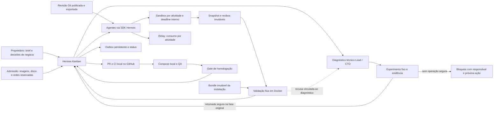
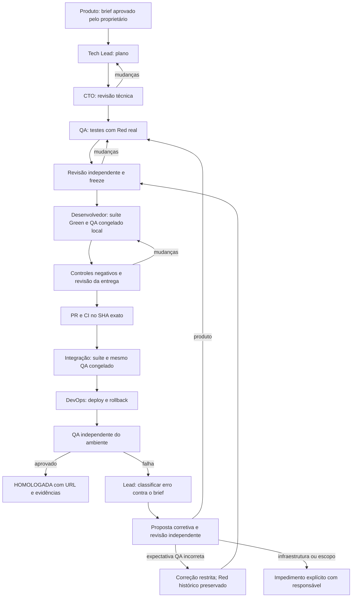

# Fabriquinha

Uma equipe de agentes para transformar um brief em software revisado, testado e
entregue em homologação, com GitHub e infraestrutura própria.

**Experimental. Primeiro ciclo técnico completo sem intervenção externa qualificado.**
O caminho em validação usa **Hermes + Kanban nativos**, com operações determinísticas para
qualidade, publicação e implantação. Multica e Temporal não são dependências
desse caminho. A instalação legada está preservada e pausada.

[Status atual](docs/STATUS.md) · [Próximos passos](docs/ROADMAP.md) ·
[Revisão crítica de 26/10/2026](docs/EXECUTION-REVIEW-2026-10-26.md) ·
[Documentação](docs/README.md)

## O que queremos construir

O proprietário informa o objetivo de uma versão e aprova seu brief. A equipe
planeja, escreve testes, implementa, revisa, integra e entrega uma URL de
homologação com evidências. Impasses técnicos pertencem ao Tech Lead e ao CTO;
decisões de negócio pertencem ao proprietário.

A release só termina com sucesso em `HOMOLOGADA`. Worker ativo, card concluído
ou testes do controlador passando não equivalem a uma release entregue. Uma
pausa humana ou dependência externa também não significa cancelamento.

## Arquitetura atual


```mermaid
flowchart LR
    CEO[Proprietário: brief e decisões de negócio] --> K[Hermes Kanban]
    A[Admissão: imagens, disco e redes reservadas] --> K
    SRC[Revisão Git publicada e exportada] --> W[Agentes via SDK Hermes]
    K --> W
    W --> S[Sandbox por atividade e deadline interno]
    S --> E[Snapshot e recibos imutáveis]
    E --> V[Validação fixa em Docker]
    VB[Bundle imutável da instalação] --> V
    V --> K
    K --> G[PR e CI local no GitHub]
    G --> D[Compose local e QA]
    D --> H[Gate de homologação]
    H --> K
    K --> O[Outbox persistente e status]
    W --> U[Relay: consumo por atividade]
    K --> R[Diagnóstico técnico Lead / CTO]
    V -.->|recusa vinculada ao diagnóstico| R
    R --> X[Experimento fixo e evidência]
    X -->|retomada segura na fase original| K
    X -->|sem operação segura| B[Bloqueio com responsável e próxima ação]
```

Kanban é o dono do ciclo de vida. O controlador executa operações fixas e verifica
artefatos; os agentes não recebem credenciais de infraestrutura nem socket Docker.
O journal de efeitos evita duplicar ações com confirmação incerta e não é um
segundo gerenciador de tarefas.

Diagnósticos podem observar relatórios com erros para orientar reparos; esses
relatórios continuam impedindo aprovação em todos os gates de entrega.

Uma orientação técnica aplicada abre contexto SDK novo, reconstituído pelos
artefatos e achados duráveis. O histórico anterior permanece arquivado. Pausas
financeiras mantêm a sessão e a fase; não são tratadas como uma falha técnica nova.

Entregas reais exigem as duas redes de homologação reservadas antes do despacho
pago. O deploy usa essas redes como externas; não aloca sub-redes implicitamente.
O preparo é explícito e não remove redes desconhecidas ou repete criações incertas.

O suporte atual é limitado a uma stack Python/HTTP local, containers Linux ARM64
na instalação de referência e uma release ativa por projeto. Não há instalador
completo qualificado para terceiros. A matriz de nove perfis permite especialistas
sob demanda; não exige nove passagens para toda atividade.

## Fluxo da equipe


```mermaid
flowchart TD
    B[Produto: brief aprovado pelo proprietário] --> P[Tech Lead: plano]
    P --> C[CTO: revisão técnica]
    C -->|mudanças| P
    C --> T[QA: testes com Red real]
    T --> F[Revisão independente e freeze]
    F -->|mudanças| T
    F --> I[Desenvolvedor: suíte Green e QA congelado local]
    I --> N[Controles negativos e revisão da entrega]
    N -->|mudanças| I
    N --> PR[PR e CI no SHA exato]
    PR --> M[Integração: suíte e mesmo QA congelado]
    M --> D[DevOps: deploy e rollback]
    D --> Q[QA independente do ambiente]
    Q -->|aprovado| H[HOMOLOGADA com URL e evidências]
    Q -->|falha| X[Lead: classificar erro contra o brief]
    X --> R[Proposta corretiva e revisão independente]
    R -->|produto| T
    R -->|expectativa QA incorreta| RT[Correção restrita; Red histórico preservado]
    RT --> F
    R -->|infraestrutura ou escopo| E[Impedimento explícito com responsável]
```

O código conecta essas etapas; as provas determinísticas exercitam a cadeia.
O [reparo mínimo](docs/ADR-0004-SCOPED-REPAIR.md) limita-se ao último pacote
serializado e, para testes, à expectativa textual QA explicitamente autorizada.
Não é replanejamento geral nem permissão para remover cobertura.
O [PR 59](https://github.com/codifydeep/descartavel2/pull/59) completou a primeira
entrega técnica sem intervenção externa: nove testes, controles, revisão,
PR/CI, deploy, rollback e QA. O ensaio reutilizou explicitamente um brief já
aprovado; não comprova descoberta de requisitos novos. Veja o
[escopo da qualificação S4](docs/HERMES-S4-QUALIFICATION.md). Continuidade entre
versões, distribuição e canais de comunicação ainda exigem validação.

A [auditoria](docs/EXECUTION-REVIEW-2026-10-25.md) encontrou um gate de mutações
incompatível com um teste auxiliar congelado. O [contrato 2 aprovado](docs/ADR-0003-BEHAVIOR-CONTROL-TARGETS.md)
corrige essa exigência e passou em prova física de navegador. Caminhos de
recuperação, memória entre versões e portabilidade continuam incompletos.

## Qualidade e segurança

- Red real → revisão independente dos testes → freeze → Green → controles
  negativos → revisão da entrega → PR/CI → QA da implantação.
- Testes existentes e descoberta protegidos; nenhum skip ou aprovação textual
  substitui execução. Correções legítimas exigem outra revisão, nunca alteração
  silenciosa do snapshot.
- Instalações novas fixam os scripts de validação em snapshot imutável; edição
  do checkout não altera os jobs nem reinterpreta provas anteriores.
- Revisores leem entregas imutáveis. Validações executam comandos fixos em
  containers sem credenciais, sem socket e com rede restrita à fase.
- Aprovações vinculadas a autoria, execução e artefato; integração e QA conferem
  o commit e a imagem efetivamente implantados.
- Na stack com browser TDD e papéis de entrega, Green, revisão e CI executam
  também o QA congelado, pelo mesmo interpretador do pós-deploy. Texto esperado
  significa texto completo normalizado; uma suíte unitária verde não o substitui.
- Pausa persistente, limites explícitos de consumo, nenhuma troca automática
  de modelo ou ampliação automática de orçamento.
- Recuperação técnica já foi demonstrada em cenários delimitados. Não há
  garantia de recuperação de todo impasse ou ausência universal de starvation.

## Organização do código

```text
src/fabriquinha/       Caminho novo: runtime, Kanban, qualidade e entrega
tests/                Testes offline do núcleo
scripts/              Preparação parcial, qualificações e publicação segura
docs/                 Status, plano vigente, arquitetura e provas delimitadas
Dockerfile*           Receitas de imagem; veja limites de reprodução
team-delivery-kit/    Legado preservado e utilitário de agrupamento Docker
bootstrap/infra/      Histórico; não iniciar junto ao caminho novo
```

Os caminhos legados permanecem para recuperação e referências de builds.
Não são o ponto de partida de uma instalação nova. Histórico detalhado e versões
anteriores deste README continuam no Git; o README não é diário de operação.

## Começar sem gastar tokens

A suíte do núcleo foi verificada com Python 3.14, inclusive sem pacotes de
`site-packages`. Ela não precisa do SDK Hermes, Docker ou chave de modelo:

```bash
git clone https://github.com/codifydeep/fabriquinha.git
cd fabriquinha
python3.14 -m venv .venv
. .venv/bin/activate
PYTHONPATH=src python -m unittest discover -s tests -q
python scripts/check_publication.py
```

Isso testa o controlador, não inicia agentes e não instala a plataforma. As
qualificações com Hermes/Docker têm dependências próprias e procedimentos em
[SETUP](docs/SETUP.md). Não execute overrides de instalações históricas como
se fossem um instalador. Imagens locais por digest ainda não asseguram
reprodução a partir de um clone limpo.

## Situação das validações

Em 26/10/2026, o núcleo passou em 306 testes. O reparo mínimo completou uma
homologação assistida. As provas S1–S3 e extensões qualificam fronteiras
específicas; decisões programadas não são julgamento de um agente real.

O [ADR 0005](docs/ADR-0005-VALIDATION-AND-ACCOUNTING.md) fixa os validadores das
instalações novas e contabiliza campos de custo/cache retornados pelo provedor,
sem estimar gasto ausente. Foi qualificado em treze jobs Docker/Chromium e nove
atividades SDK com respostas locais, sem chamadas pagas. O comando `runtime
costs` consulta o relay local autenticado e não libera pausas nem faz inferência.

O [S4](docs/HERMES-S4-QUALIFICATION.md) foi concluído sem correção externa do
controlador ou dos artefatos após o aceite do brief. Foram 31 chamadas e
US$ 0,074938 reportados. Os PRs 57/58 permanecem assistidos. Falta a segunda
versão com regressão/memória/recuperação e uma instalação reproduzível em outro
repositório. Telegram real ainda não está configurado nesta fronteira.
Veja o [roadmap](docs/ROADMAP.md).

## Retirada de recursos de teste

Todo container novo deve aparecer em um grupo Compose no Docker Desktop.
Serviços, testes descartáveis e homologação têm grupos próprios por instância.

Antes e depois de um ciclo, inventarie apenas recursos com propriedade comprovada.
Confirme ausência de leases ativos, preserve logs e recuperação e remova por ID
exato. O preview `team-delivery-kit/cleanup_port2_history.py --tests-only` vale
somente para os helpers port2 qualificados, não para qualquer nome parecido.
A limpeza de imagens usa `cleanup_obsolete_images.py` e o hash do plano revisado.

Não usar prune global, force ou apagar volumes/snapshots como rotina. Preservar
deploy atual, referências de build, rollback e projetos alheios, incluindo
`toso-*` e `reforma`. Consulte [AGENTS.md](AGENTS.md).

## Contribuição e licença

Não publicar chaves, instalações privadas, bancos, conversas, snapshots ou
worktrees de produtos. Rodar `python scripts/check_publication.py` sobre o
conteúdo staged antes de publicar. Mudanças da automação e entregas de produtos
têm contratos de revisão distintos; nunca transportar uma dispensa entre eles.

Código próprio sob [MIT](LICENSE). Dependências mantêm suas licenças.
